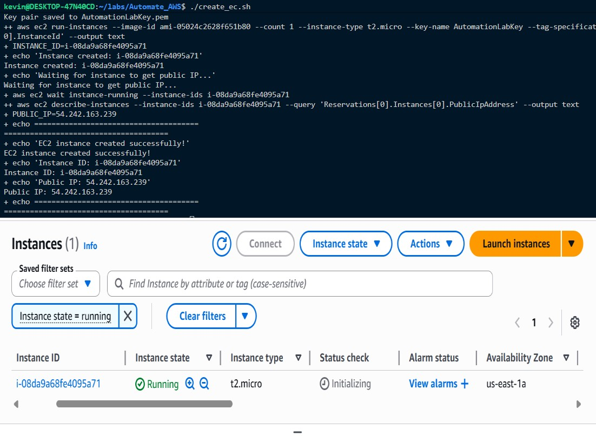
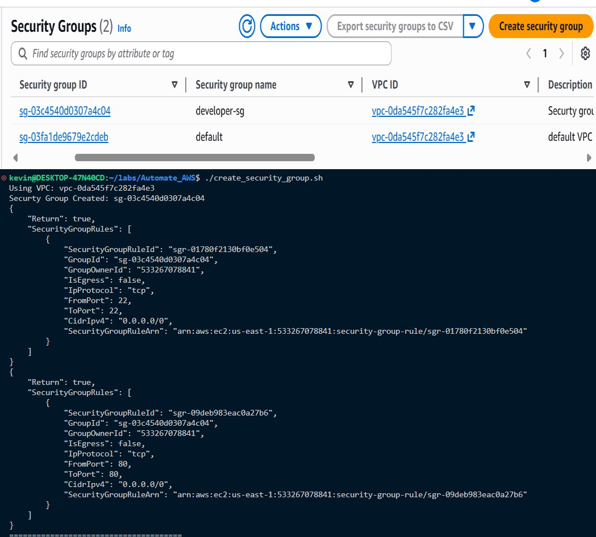
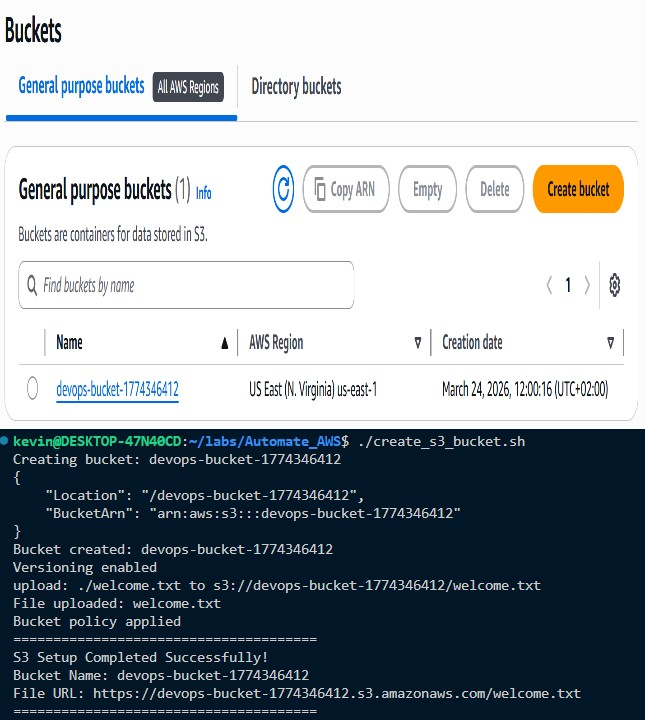
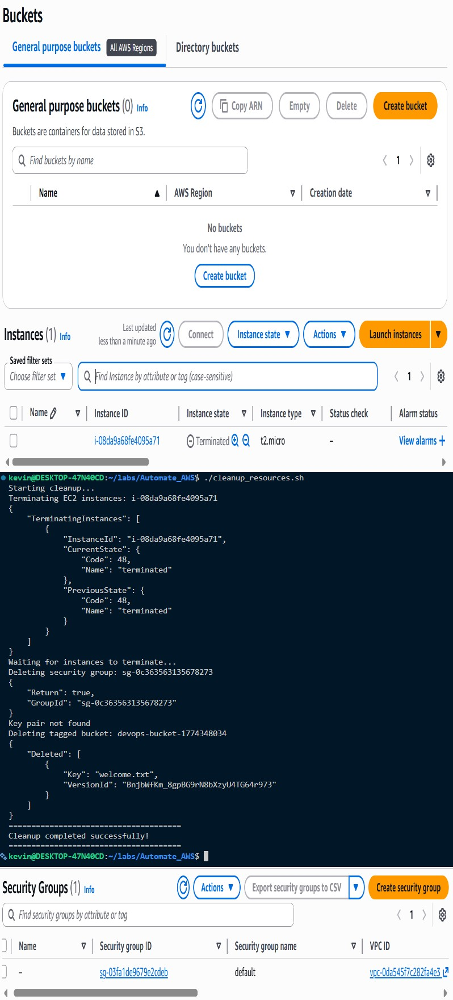

# AWS Automation with Bash Scripts

## Project Overview

This project demonstrates how to automate the creation and management of essential AWS resources using Bash scripts and the AWS CLI.

The goal is to eliminate manual provisioning by scripting the setup of:

* EC2 instances
* Security groups
* S3 buckets

This improves efficiency, reduces human error, and ensures consistent infrastructure deployment.


## Objectives

* Automate AWS resource provisioning using Bash
* Use AWS CLI effectively for infrastructure management
* Apply best practices such as parameterization and error handling
* Implement secure configurations using IAM credentials
* Practice resource cleanup and lifecycle management


## Project Structure

```
.
├── .gitignore
├── README.md
├── create_ec2.sh
├── create_security_group.sh
├── create_s3_bucket.sh
├── cleanup_resources.sh
└── images/
    ├── ec2_creation.jpeg
    ├── security_group.png
    ├── s3_bucket.png
    └── cleanup.png
```

---

## Prerequisites

Before running the scripts, ensure you have:

* AWS CLI installed
* Configured AWS credentials:

  ```bash
  aws configure
  ```
* Verified configuration:

  ```bash
  aws sts get-caller-identity
  aws configure list
  ```

---

## Tasks & Implementation

### Task 1: AWS CLI Setup

Configured AWS CLI with valid credentials and verified access.

---

### Task 2: EC2 Instance Automation (`create_ec2.sh`)

This script:

* Creates an EC2 key pair
* Launches an EC2 instance (Amazon Linux 2 - Free Tier)
* Tags the instance (`Project=AutomationLab`)
* Outputs:

  * Instance ID
  * Public IP address

#### Screenshot



---

### Task 3: Security Group Automation (`create_security_group.sh`)

This script:

* Creates a security group (`devops-sg`)
* Configures inbound rules:

  * Port 22 (SSH)
  * Port 80 (HTTP)
* Displays:

  * Security Group ID
  * Configured rules

#### Screenshot



---

### Task 4: S3 Bucket Automation (`create_s3_bucket.sh`)

This script:

* Creates a uniquely named S3 bucket
* Enables versioning
* Applies a simple bucket policy
* Uploads a sample file (`welcome.txt`)

#### Screenshot



---

### Task 5: Cleanup Script (`cleanup_resources.sh`)

This script:

* Identifies resources using tags (`Project=AutomationLab`)
* Terminates EC2 instances
* Deletes S3 buckets and contents
* Removes security groups safely

#### Screenshot



---

## How to Run

Make scripts executable:

```bash
chmod +x *.sh
```

Run scripts individually:

```bash
./create_security_group.sh
./create_ec2.sh
./create_s3_bucket.sh
```

Cleanup resources:

```bash
./cleanup_resources.sh
```

---

## Best Practices Applied

* Resource tagging for easy management
* Error handling in scripts
* Modular and reusable script design
* Secure use of AWS credentials


## Challenges & Solutions

| Challenge                  | Solution                           |
| -------------------------- | ---------------------------------- |
| Unique S3 bucket naming    | Used timestamp/random suffix       |
| IAM permission errors      | Ensured correct IAM roles/policies |
| Resource dependency issues | Ordered execution (SG → EC2)       |
| Cleanup safety             | Used tagging and filters           |


## Author

**Kevin Ishimwe**

